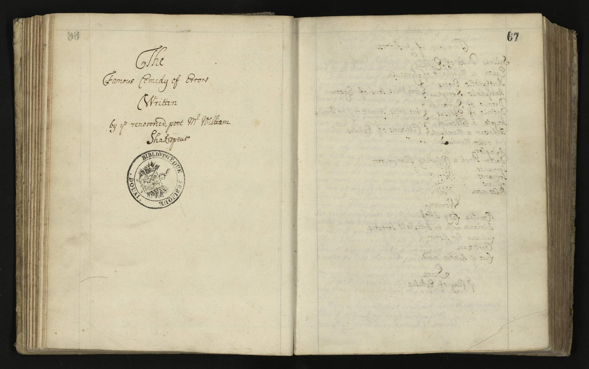
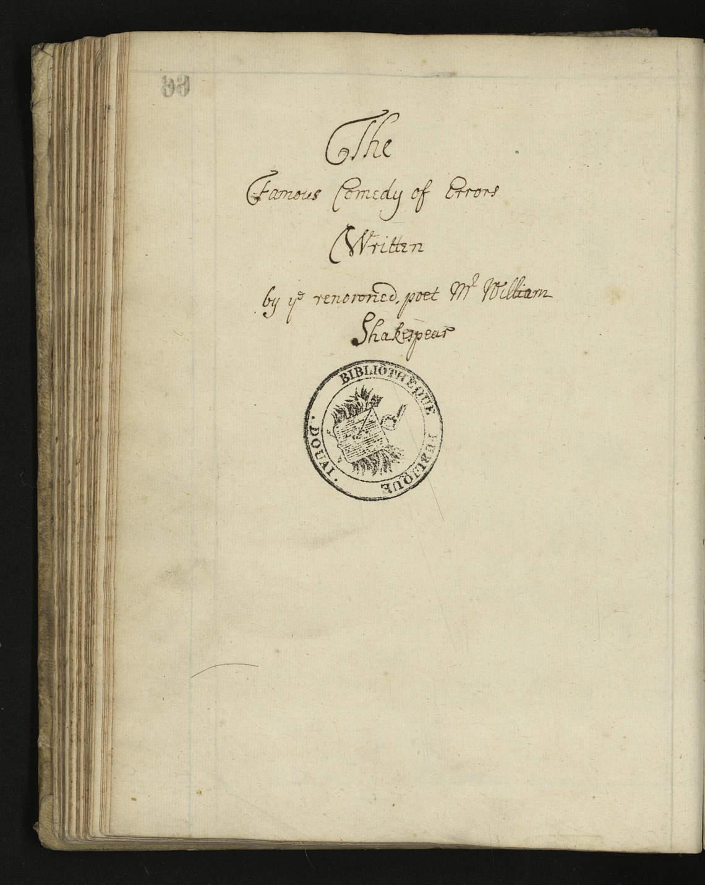
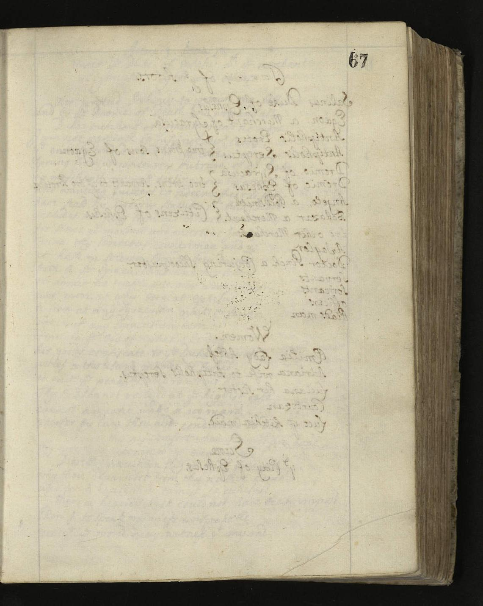

# cropImage

A  tool for cropping facsimile

## Use case

You are a digital humanist working on a early modern manuscript and you have a facsimile made by your library. For example, that one :

Unfortunately, your digital editions is based on a page by page visualization. So you need a scan for each image in the manuscript in the contexte where you don't have the money or the graphic skills to split your images in two... Worse, you fear a reduction in the quality of your images by using online services.

Here comes cropImage. CropImage assumes that the people who scanned your manuscript did their job correctly and that the middle of the facsimile matchs the space between the two pages. CropImage will separate the two halves of your scan while maintaining its quality. You will obtain this:

Fast and open-source: you are good to publish!

## Installation

Just need a python3 installation with the "Pillow" Package.

## Quick run

Run "main.py" in your favorite IDE.

## Parameters

cropImage comes with somes parameters that you can customize at your own.

Just open "param.py" and update them:

* **fileId**. Name of the finale files
* **pathInput**. Name of the input directory
* **pathOutput**. Name of the output directory
* **fileExtension**. Extension of the current image.